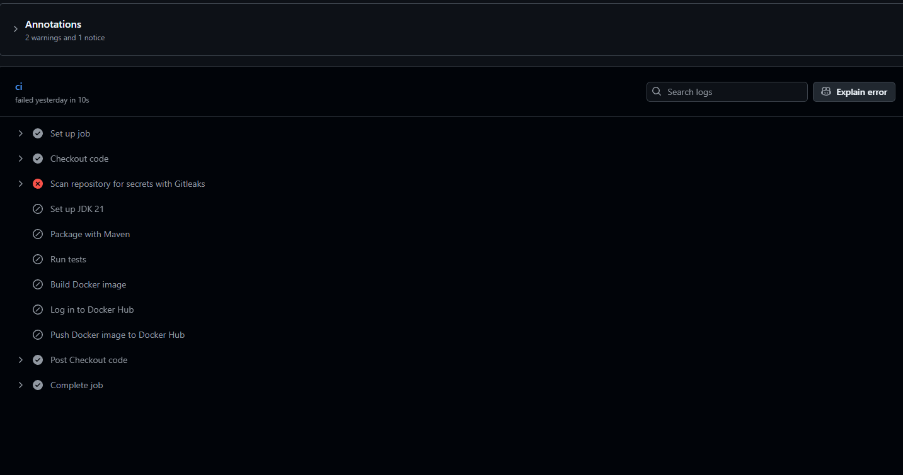
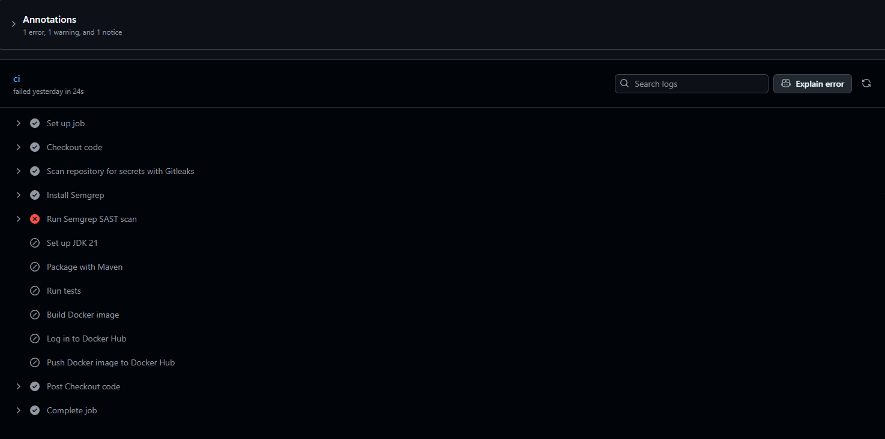
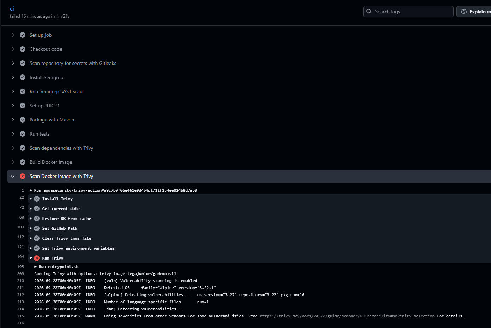
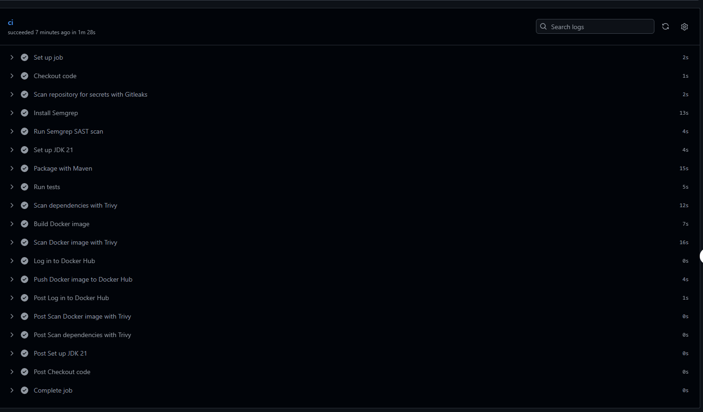

# GA Demo — GitHub Actions CI/CD & DevSecOps Pipeline

This project demonstrates a complete CI/CD pipeline using GitHub Actions for a Java Spring Boot application. The pipeline builds and tests the application, performs multiple security scans, builds a Docker image, scans the final container image, and pushes the image to Docker Hub only when all required checks pass.

## Technology Stack

- Java 21
- Spring Boot
- Maven
- Docker
- GitHub Actions
- Gitleaks
- Semgrep
- Trivy
- Docker Hub

## CI/CD Pipeline

The GitHub Actions workflow is located at:

```text
.github/workflows/gademo-workflow.yml
```

The pipeline runs automatically when changes are pushed to the `main` branch.

The workflow executes the following stages:

```text
Push to main
      |
      v
Checkout source code
      |
      v
Gitleaks secret scan
      |
      v
Semgrep SAST scan
      |
      v
Maven package
      |
      v
Maven tests
      |
      v
Trivy filesystem vulnerability scan
      |
      v
Docker image build
      |
      v
Trivy container image scan
      |
      v
Docker Hub login
      |
      v
Docker image push
```

The security scans act as CI/CD gates. If a blocking security check fails, later deployment stages are skipped.

## Security Scanning

### Gitleaks — Secret Scanning

Gitleaks scans the Git repository for exposed credentials and secrets before the application is built and published.

A controlled training secret was committed to the repository to verify the security gate.

Gitleaks successfully detected the simulated secret and returned a failing exit code. The later Docker build and push stages were therefore skipped.

The simulated secret was subsequently removed and the pipeline passed again.



### Semgrep — Static Application Security Testing

Semgrep performs Static Application Security Testing (SAST) against the source repository.

The initial scan identified five findings, including:

- GitHub Actions referenced using mutable version tags.
- The Docker container running without an explicitly configured non-root user.

The Dockerfile was hardened by creating and using an `appuser`, and the GitHub Actions dependencies were pinned to full commit SHAs.

After remediation, Semgrep reported:

```text
0 findings
Exit code: 0
```

A controlled failing pipeline run also demonstrated that Semgrep findings stop later Docker stages from executing.



### Trivy — Dependency Vulnerability Scanning

Trivy filesystem scanning is used to inspect the project's application dependencies for known vulnerabilities.

The scan identified vulnerable Spring Boot/Tomcat dependencies during testing.

The application dependencies were updated, including:

```text
Spring Boot: 3.4.2 -> 3.5.16
Tomcat:      10.1.60
```

After remediation, the HIGH/CRITICAL vulnerability scan returned:

```text
HIGH:     0
CRITICAL: 0
Exit code: 0
```

The GitHub Actions pipeline uses the following security policy:

```text
HIGH or CRITICAL vulnerability detected
        |
        v
Trivy exits with code 1
        |
        v
Pipeline stops
```

## Docker Security

The Docker container is configured to run the application as a non-root user.

The Dockerfile creates an application user and group:

```dockerfile
RUN addgroup -S appgroup && adduser -S appuser -G appgroup
```

The application artifact is assigned to that user:

```dockerfile
COPY --chown=appuser:appgroup target/gademo-0.0.1-SNAPSHOT.jar /app/
```

The runtime user is then changed from root:

```dockerfile
USER appuser
```

This was verified locally with:

```bash
docker exec gademo-security-test whoami
```

which returned:

```text
appuser
```

## Trivy Container Image Scanning

The final Docker image is also scanned before it is pushed to Docker Hub.

This provides an additional security layer because a clean application dependency scan does not guarantee that the operating system packages inside the container are free from known vulnerabilities.

The original container image produced HIGH and CRITICAL findings originating from Alpine Linux packages.

Testing a newer BellSoft Java 21 base image still produced HIGH and CRITICAL operating-system findings.

The Dockerfile was therefore updated to use:

```dockerfile
FROM bellsoft/liberica-openjdk-alpine:21.0.8
RUN apk upgrade --no-cache
```

The upgraded packages included patched versions of components such as:

```text
libcrypto3
libssl3
musl
musl-utils
zlib
```

After rebuilding the image, the Trivy scan reported:

```text
Alpine OS: 0 HIGH/CRITICAL
Java JAR:  0 HIGH/CRITICAL
Exit code: 0
```

The image scan runs after the Docker build but before authentication and publication:

```text
Docker Build
     |
     v
Trivy Image Scan
     |
     +---- FAIL ----> Stop pipeline
     |
    PASS
     |
     v
Docker Hub Login
     |
     v
Docker Push
```

A controlled failure test was performed by temporarily removing the Alpine package upgrade from the Dockerfile.

The resulting image contained known HIGH/CRITICAL vulnerabilities. Trivy failed the GitHub Actions job, and the Docker login and push stages were skipped.

The remediation was restored and the pipeline passed successfully.



## GitHub Actions Security

Third-party GitHub Actions used by the workflow are pinned to full commit SHAs rather than mutable version tags.

Examples include:

```text
actions/checkout
gitleaks/gitleaks-action
actions/setup-java
docker/login-action
aquasecurity/trivy-action
```

SHA pinning reduces the risk of an Action version tag being changed to reference different code after the workflow has been created.

## Security Gate Summary

| Security Control | Purpose | Blocking |
|---|---|---|
| Gitleaks | Detect committed secrets | Yes |
| Semgrep | Static application security testing | Yes |
| Trivy filesystem scan | Detect vulnerable application dependencies | Yes |
| Non-root container | Reduce container runtime privileges | N/A |
| Trivy image scan | Detect vulnerabilities in the final container | Yes |
| SHA-pinned Actions | Reduce CI/CD supply-chain risk | N/A |

## Successful Pipeline

After all vulnerabilities and configuration findings were remediated, the complete GitHub Actions pipeline executed successfully.

The final pipeline successfully:

- scanned the repository for secrets;
- performed static security analysis;
- packaged the Spring Boot application;
- ran the automated tests;
- scanned application dependencies;
- built the Docker image;
- scanned the final Docker image;
- authenticated to Docker Hub; and
- pushed the approved image to Docker Hub.



## Security Gate Validation

The project intentionally tested both successful and failing CI/CD paths.

```text
Gitleaks failure
      -> pipeline blocked
      -> Docker stages skipped

Semgrep failure
      -> pipeline blocked
      -> Docker stages skipped

Trivy image failure
      -> pipeline blocked
      -> Docker push skipped

Security issues remediated
      -> all security gates passed
      -> Docker image pushed successfully
```

These tests demonstrate that the security tools are enforcement controls rather than informational scans only.

## Docker Image

Successful pipeline runs publish versioned Docker images using the GitHub Actions run number:

```text
tegajunior/gademo:v<github-run-number>
```

Each image is built and security-scanned before it is pushed.

## Running Locally

Package and test the application:

```bash
./mvnw package
./mvnw test
```

Build the Docker image:

```bash
docker build -t gademo .
```

Run the container:

```bash
docker run -d -p 6767:6767 --name gademo gademo
```

The application listens on port:

```text
6767
```

## Project Structure

```text
gademo/
├── .github/
│   └── workflows/
│       └── gademo-workflow.yml
├── screenshots/
│   ├── github-actions-success.png
│   ├── gitleaks-security-failure.png
│   ├── semgrep-security-gate.png
│   └── trivy-image-security-gate.png
├── src/
├── Dockerfile
├── pom.xml
├── mvnw
└── README.md
```

## Conclusion

This project demonstrates a CI/CD workflow with security controls integrated throughout the software delivery process.

The final workflow follows a build, scan, and publish approach in which source code, application dependencies, and the final container image are checked before the Docker image is published.

The completed pipeline demonstrates:

- automated build and testing;
- secret detection;
- static application security testing;
- dependency vulnerability scanning;
- non-root container execution;
- container image vulnerability scanning;
- SHA-pinned GitHub Actions; and
- automated Docker image publication after successful security validation.
